# Multimodal Price Prediction

**Predicting product price from a product photo and its catalog text — a two-tower, late-fusion regression pipeline with a distribution-aware head, built and evaluated end-to-end on CPU.**


## Overview

Given a product listing — a photo plus a short, seller-written catalog text blob (item name, marketing bullet points, a parsed quantity value + unit) — predict the listing's price. The dataset is roughly 75,000 grocery-product listings drawn from a large e-commerce product catalog.

This is a deceptively hard regression problem:

- **Weak, noisy supervision.** The only text is free-form seller copy, not a curated spec sheet: the `Unit` field alone has 99 distinct raw spellings (`Ounce`, `ounce`, `OZ`, `Fl. Oz`, ... — collapsing to 70 after simple case normalization, confirmed in the [EDA notebook](notebooks/01_eda.ipynb)), a literal `"None"` sentinel shows up in `Unit` for ~1.25% of rows, and at least a quarter of listings have zero bullet points. Price itself is set by a seller/market process only loosely coupled to anything visible in the listing.
- **Heavy-tailed target.** Price ranges from $0.13 to $2,796, with a median around $14 and a mean around $23.6 pulled well above the median by a long right tail. A handful of expensive listings can dominate ordinary loss functions and R² if you're not careful — hence SMAPE as the primary metric.
- **Modality imbalance.** Product photography is a weak, indirect price signal — packaging design correlates only loosely with price (see [failure modes](docs/ARCHITECTURE.md#failure-modes)) — while catalog text, especially the explicit quantity/unit fields, carries most of the exploitable signal. A naive fusion model can end up effectively ignoring the image tower.

The approach: frozen pretrained encoders (fast, no GPU required) turn each modality into a fixed embedding; a small set of interpretable heads are compared on top of the fused representation, including a distribution-aware bin-classification + residual-regression head. Everything reported here runs on a CPU laptop against a stratified subsample; a full-dataset + encoder-finetuning path is scripted for a SLURM GPU cluster (see [Scaling up](#scaling-up-gpuslurm)) but has **not** been executed — no number in this repo comes from that path.

## Architecture

```mermaid
flowchart TD
    IMG["Product image"] --> VIT["Frozen ViT-S/16 (timm)<br/>384-d embedding"]
    TXT["catalog_content text"] --> PARSE["Regex parser"]
    PARSE --> NAME["item name + bullet points"]
    PARSE --> QTY["value / unit / pack count"]
    NAME --> MINILM["MiniLM-L6-v2<br/>mean-pooled, 384-d"]
    QTY --> TAB["Tabular features<br/>value, unit one-hot,<br/>pack count, text-length stats"]

    VIT --> IMGFEAT(("image<br/>features"))
    MINILM --> TXTFEAT(("text<br/>features"))

    TXTFEAT --> RIDGE["ridge_text"]
    TXTFEAT --> HGBTEXT["hgb_text"]
    IMGFEAT --> HGBIMG["hgb_image"]

    IMGFEAT --> CONCAT["concat"]
    TXTFEAT --> CONCAT
    TAB --> CONCAT

    CONCAT --> HGBFUSED["hgb_fused"]
    CONCAT --> BINRES["binres_fused"]
    CONCAT --> MLPFUSED["mlp_fused"]

    RIDGE --> EVAL{{"SMAPE / MAE / RMSLE / R²"}}
    HGBTEXT --> EVAL
    HGBIMG --> EVAL
    HGBFUSED --> EVAL
    BINRES --> EVAL
    MLPFUSED --> EVAL
```



Both encoders stay **frozen**; only the heads on top of them are trained. See [docs/ARCHITECTURE.md](docs/ARCHITECTURE.md) for the full design rationale.

## Method

### Target transform & quantile discretization

The regression target is `log(price)`: price is strictly positive and roughly log-normal in shape, so modeling in log-space keeps the loss well-behaved and turns multiplicative errors into additive ones. For the distribution-aware head, log-price is further discretized into **K = 10 quantile bins** (equal-frequency, edges fit on the training split only) — turning "how much does this cost" into a coarse "which price regime" classification problem plus a fine-grained residual correction (below).

### Frozen-encoder representation extraction ("shallow probing")

Both modality encoders — ViT and MiniLM — stay frozen throughout every CPU experiment. Each image/text is embedded once, cached, and every downstream head is trained as a probe on top of these fixed 384-d representations: linear for `ridge_text`, tree ensembles for the `hgb_*` heads, a small classifier + regressor for `binres_fused`, a couple of dense layers for `mlp_fused`. This keeps the head comparison isolated to "what can be read off a frozen, general-purpose representation," rather than confounded by how well each head happens to finetune the backbone. The [SLURM path](#scaling-up-gpuslurm) revisits this assumption by finetuning encoders directly.

### Late fusion

Image and text embeddings (384-d each) are concatenated with a block of engineered tabular features — parsed quantity `Value`, one-hot `Unit`, a regex-parsed pack count (e.g. "Pack of 6"), and text-length statistics (character/word/bullet counts) — into a single fused feature vector. Fusion is plain concatenation, with no learned cross-modal attention; this keeps every head directly comparable and makes per-modality ablation (`hgb_image` vs. `hgb_text` vs. `hgb_fused`) a clean measurement of what each modality contributes.

### The distribution-aware bin + residual head

Rather than regress log-price directly, `binres_fused`:

1. classifies which of **K = 10** empirical quantile bins of log-price the listing falls into, producing a posterior `p(k | x)` over bins;
2. regresses the **within-bin, heteroscedasticity-normalized residual** — i.e. it predicts `(log p − μ_k) / σ_k` using each bin's own mean/std, so the regression target has comparable scale regardless of price regime;
3. decodes a single point estimate as a posterior-weighted expectation:

$$\hat{y} = \exp\left(\sum_k p(k \mid x)\cdot \mu_k \;+\; \hat{r}\cdot\bar{\sigma}\right)$$

   where `μ_k` / `σ_k` are the per-bin log-price mean/std (fit on the training split) and `σ̄` is a fixed, pooled residual scale. Full derivation and a discussion of the free uncertainty signal (bin-posterior entropy) in [docs/ARCHITECTURE.md](docs/ARCHITECTURE.md#the-bin--residual-head-in-full).

### Why SMAPE

$$\text{SMAPE} = \frac{100}{n}\sum_{i=1}^{n} \frac{|y_i - \hat{y}_i|}{(|y_i| + |\hat{y}_i|)/2}$$

SMAPE is bounded (0–200%), scale-free, and symmetric in over- vs. under-prediction — well suited to a target spanning four orders of magnitude ($0.13–$2,796). Raw MAE is dominated by expensive items; plain MAPE blows up near zero and penalizes over/under-prediction asymmetrically. MAE, RMSLE and R² are reported alongside SMAPE as secondary diagnostics, with RMSLE in particular mirroring the log-space training objective.

## Results

*Experiments run on a stratified 8,000-sample subset of the full ~75k listings (85/15 train/val split), CPU only; all seeds fixed.*

| Model | SMAPE ↓ | MAE ↓ | RMSLE ↓ | R² ↑ |
|---|---|---|---|---|
| `ridge_text` | 66.07 | 14.94 | 0.861 | 0.158 |
| `hgb_image` | 64.24 | 14.23 | 0.834 | 0.209 |
| `hgb_text` | 63.32 | 14.09 | 0.826 | 0.223 |
| `hgb_fused` | 59.53 | 13.16 | 0.772 | 0.319 |
| **`binres_fused`** | **57.83** | **12.85** | **0.755** | **0.349** |
| `mlp_fused` | 59.94 | 13.84 | 0.796 | 0.287 |

Two takeaways: **fusion helps** — the fused tree ensemble beats the best single-modality head by ~3.8 SMAPE points — and the **distribution-aware `binres_fused` head wins overall**, adding another ~1.7 points over direct fused regression. Values are copied verbatim from [`reports/metrics.json`](reports/metrics.json) (1,200 validation rows); see [docs/EXPERIMENTS.md](docs/EXPERIMENTS.md) for the per-head log and [`reports/RUN_NOTES.md`](reports/RUN_NOTES.md) for wall-clock details.


## Dataset

~75,000 grocery-product listings from a large e-commerce product catalog, one row each:

| Column | Type | Description |
|---|---|---|
| `sample_id` | int | unique row identifier |
| `catalog_content` | str | semi-structured seller text: `Item Name: ...`, zero or more `Bullet Point N: ...` lines, `Value: <float>`, `Unit: <str>` |
| `image_link` | str (URL) | link to the product's primary image |
| `price` | float | target — listing price, in currency units |

Price is heavy-tailed across the full 75k rows: min $0.13, median ≈ $14, mean ≈ $23.6, max $2,796. See [`notebooks/01_eda.ipynb`](notebooks/01_eda.ipynb) for the full exploratory pass, including unit-string cardinality, text-length distributions, and the price/quantity relationship.


Raw data is **not committed** to this repository. See [`data/README.md`](data/README.md) for the expected layout and how to obtain it; a 200-row preview (seed 42) is committed at [`data/sample/train_sample.csv`](data/sample/train_sample.csv) for smoke-testing without the full dataset.

## Reproduce

```bash
git clone <this-repo-url>
cd Multimodal_Price_Prediction
pip install -r requirements.txt
```

Place the data as described in [`data/README.md`](data/README.md) (expects `data/dataset/train.csv` + `data/Train_Images/`), then run the local pipeline end-to-end:

```bash
# Linux / macOS / WSL
bash scripts/run_pipeline.sh

# Windows
powershell -File scripts/run_pipeline.ps1
```

This runs parsing, embedding extraction, feature building, all six heads, and evaluation against the stratified subsample configured in [`config/config.yaml`](config/config.yaml), then writes metrics and figures to `reports/`. Every knob — subsample size, split ratio, seeds, model names, number of quantile bins, per-head hyperparameters — lives in that one config file.

## Scaling up (GPU/SLURM)

The local pipeline above intentionally stays CPU-friendly on a stratified subsample. The full ~75k-row dataset and any encoder-finetuning are scripted for a SLURM GPU cluster under [`slurm/`](slurm/):

- [`slurm/sync_to_cluster.sh`](slurm/sync_to_cluster.sh) — rsyncs the repo + a data manifest to the cluster
- [`slurm/extract_embeddings.sbatch`](slurm/extract_embeddings.sbatch) — job-array sbatch that embeds the full 75k rows with the frozen ViT + MiniLM towers, chunked across array tasks
- [`slurm/finetune_encoders.sbatch`](slurm/finetune_encoders.sbatch) — LoRA-finetunes both encoders jointly with the MLP fusion head on the full dataset
- [`slurm/submit_all.sh`](slurm/submit_all.sh) — submits the two jobs in dependency order

These scripts are written to be correct and ready to submit against the target cluster, but **have not been executed** — see [`docs/PROGRESS.md`](docs/PROGRESS.md) (phase P5) and [`docs/EXPERIMENTS.md`](docs/EXPERIMENTS.md). No result in this repository comes from the GPU path.

## Explored directions & future work

A few directions were prototyped earlier in this project's history — configs and/or adapter weights exist locally — but none reached a completed, evaluated run, so **no numbers for them appear anywhere in this repo**:

- **LoRA-finetuned Qwen2-VL-2B-Instruct as a generative price regressor.** Frame price prediction as constrained text generation from a vision-language model (image + catalog text in, a price string out), fit with a LoRA adapter. Prototyped; not evaluated against the SMAPE/MAE/RMSLE/R² suite used elsewhere in this repo.
- **DeBERTa-v3 as a stronger text tower**, as a drop-in replacement for MiniLM ahead of fusion. Prototyped; not benchmarked.
- **End-to-end ViT-B/16 finetuning** (rather than a frozen ViT-S/16 probe), to measure how much frozen probing leaves on the table for the image tower specifically. Prototyped; not benchmarked.

Left as genuine future work (not started):

- **Contrastive image-text pretraining (CLIP-style)** on catalog image/text pairs before fusion, so the two towers share a representation space instead of being independently pretrained.
- **Conformal prediction intervals** built from the bin-classification posterior of the distribution-aware head — the entropy of `p(k|x)` is already a free coarse uncertainty signal; turning it into a calibrated interval is a natural next step.
- **Cross-modal attention fusion** in place of late concatenation, to let the model learn *which* tokens/patches matter for price rather than relying on a downstream head to sort it out from a flat concatenated vector.

## Repository structure

```
Multimodal_Price_Prediction/
├── README.md                  <- you are here
├── LICENSE                    <- MIT
├── requirements.txt
├── .gitignore
├── config/
│   └── config.yaml            <- every pipeline knob (paths, seeds, model names, K bins, ...)
├── src/                       <- modular pipeline, one stage per file
│   ├── parse_text.py          <- catalog_content -> item name / bullets / value / unit
│   ├── prepare_data.py        <- cleaning, log-price, quantile bins, stratified subsample + split
│   ├── extract_embeddings.py  <- frozen ViT + MiniLM embedding extraction (chunked, resumable)
│   ├── train.py               <- ridge / HistGB / bin+residual / MLP heads
│   ├── evaluate.py            <- SMAPE / MAE / RMSLE / R² + figures -> reports/
│   └── utils.py               <- metrics, seeding, config loading
├── scripts/
│   ├── run_pipeline.sh        <- one-command local (CPU) run
│   └── run_pipeline.ps1       <- Windows equivalent
├── slurm/                     <- full-dataset GPU path
│   ├── README.md
│   ├── sync_to_cluster.sh
│   ├── extract_embeddings.sbatch
│   ├── finetune_encoders.sbatch
│   └── submit_all.sh
├── notebooks/
│   └── 01_eda.ipynb           <- executed, CSV-only exploratory analysis
├── data/
│   ├── README.md              <- expected layout, schema, how to obtain data
│   └── sample/
│       └── train_sample.csv   <- 200-row preview for smoke-testing (committed)
├── reports/                   <- produced by the last real run
│   ├── metrics.json
│   ├── RUN_NOTES.md           <- wall-clock times, deviations, environment notes
│   └── figures/
│       ├── price_distribution.png
│       ├── model_comparison.png
│       ├── pred_vs_actual.png
│       ├── smape_by_decile.png
│       └── embedding_pca.png
└── docs/
    ├── PLAN.md                <- design decisions & rationale
    ├── ARCHITECTURE.md        <- deeper technical notes
    ├── EXPERIMENTS.md         <- experiment log
    └── PROGRESS.md            <- dated execution log
```

## License

MIT — see [LICENSE](LICENSE).
